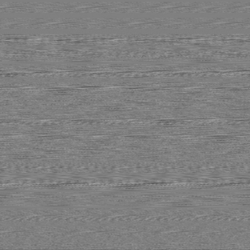

# SoundImager

## The idea
Basically a small program that generates an RGB / Greyscaled image based on the values read from a soundfile.

## Milestones
✔️ Read a WAV soundfile and convert is as a BMP image file.

✔️ Read a BMP imagefile and output it as a WAV sound file.

## Let's try it out
This is the sound file input : a plain 16 bits wave file: [Listen to it there 🔊](https://drive.google.com/file/d/1jTyiqbAVTWPcqqpqBmTR3PzEHyl-GvBJ/view?usp=sharing)

We read the wave soundfile and convert is as a BMP image file

We obtain this greyscale BMP image as a result, that represents our sound !

We then read the freshly created BMP image and output it as a WAVE soundfile

This is the sound file output :  [Listen to it there 🔊](https://drive.google.com/file/d/1Sh2ZESsFRGgfnig0Yuu0mJX-G6UknPT9/view?usp=sharing)

## But why ?
There is no particular purpose on the existence of this small project, and it is actually quite limited, but I just had this funny idea. 

I don't actually recommend using this program as you inevitably lose some sound precision due to the 8 bits scaling (0-255) of it.

Have fun!
